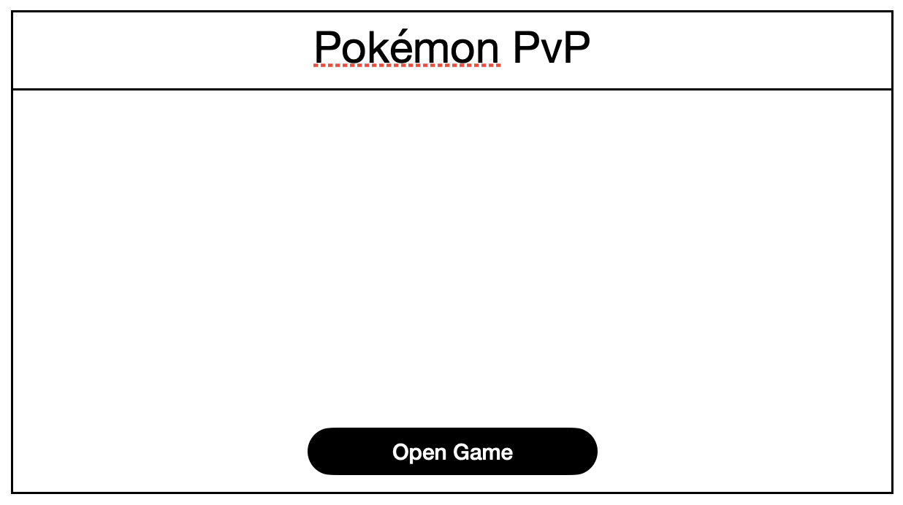
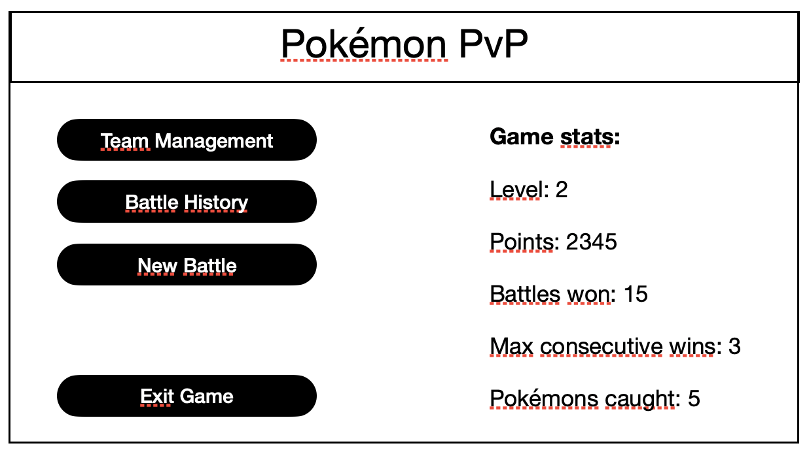

# Pokémon PvP - Vistes

Cal seguir la descripció d'aquestes vistes, però la organització dels elements i els aspectes artístics són lliures per cada equip.

## Inici

La vista inicial **"ViewStart"** de l'aplicació inclourà algun grafisme de benvinguda i un botó per escollir l'arxiu *".sqlite"*

Un cop escollit l'arxiu amb la base de dades, s'ha de fer-hi la connexió a través del *Singleton AppData*. I canviar a la vista menú **"ViewMenu"**.

## Menú

La vista de menú **"ViewMenu"** permet:

- Tornar a la vista inicial **"ViewStart"**
- Gestionar els Pokémons **"ViewManagement"**
- Començar una nova batalla **"ViewBattle0"**
- Veure les estadístiques del jugador - Gestionar els Pokémons **"ViewStats"**

A més aquesta vista mostra les estadístiques de la partida:

- Nivell de la partida
- Número de batalles realitzades
- Racha més llarga de batalles guanyades
- Número de Pokémons disponibles

## Gestió d'equips

La vista **"ViewManagement"** mostra la llista de tots els Pokémons:

- Mostra primer els Pokémons disponibles (desbloquejats)
- Es veu una clara diferència gràfica entre els Pokémons desbloquejats dels que estàn per desbloquejar
- Els Pokémons desbloquejats tenen un botó per ser editats a la vista **"ViewPokemonSettings"**

A cada *Item* de la llista, ha de mostrar almenys:

- El nom i sobrenom
- La imatge
- Estadístiques (vida, atac, estamina)

## Configuració dels Pokémons

La vista **"ViewPokemonSettings"** permet configurar alguns aspectes:

- **Sobrenom**: Nom que li posem al Pokémon, a part del seu nom oficial
- **Estadístiques**: Es poden modificar les estadístiques del Pokémon segons:

    * **X Attack**: millora l'atac durant el pròxim combat (només el pròxim)
    * **X Deffense**: millora la defensa durant el pròxim combat (només el pròxim)
    * **Bottle cap**: millora una estadística al màxim

Per poder millorar les estadístiques cal disposar de ítems tipus "X Attack", "X Deffense" o "Bottle cap". La disponibilitat de cada un d'aquests ítems s'ha de veure a la part inferior de la vista *ViewPokemonSettings*.

- **Fer servir aquests ítems, els consumeix**
- Inicialment, el jugador no té cap ítem

## Historial de batalles

La vista **"ViewHistory"** mostra la llista amb l'historial de cada batalla de la partida.

Per cada batalla s'ha de mostrar:

- La data i hora que es va jugar
- Els pokémons de cada equip (amb la imatge)
- L'equip guanyador (Player o Computer)

A més, les batalles guanyades pel propi jugador, han de tenir algun element visual que les identifiqui fàcilment (com per exemple el fons verd)

## Batalles

Les batalles tindràn diverses vistes, segons el moment de cada una:

### Opcions de la batalla

La vista **"ViewBattleOptions"** permet escollir mapa, equip i Pokémon actiu.

La vista **"ViewBattleAttack"** mostra:

- Els equips escollits de cada participant
- Les estadístiques del Pokémon actiu
- Permet escollir l'atac que farà el jugador
- Permet veure les estadístiques de l'atac sel·leccionat (i cambiar-lo abans d'atacar)
- Vida i estamina de l'oponent (però NO les estadístiques de l'oponent)

La vista **"ViewAttackResult"** mostra:

- Qui ha fet l'atac primer (segons velocitat)
- El resultat de l'atac
- Les noves estadístiques del Pokémon actiu
- Nova vida i estamina de l'oponent

**Quan el Pokémon actiu cau** (es queda sense vida o estamina), es torna a la vista **"ViewBattleOptions"**, però només es permetrà escollir el Pokémon actiu dels dos disponibles. 

- No permetrà escollir mapa (ja està escollit)
- No permetrà escollir equip (ja està escollit)
- No permetrà escollir el/els Pokémons que ja han caigut

Si només queda un Pokémon disponible, aleshores no permet escollir res. Només veure les opcions escollides.

La vista **"ViewBattleResult"** mostra:

- El resultat final de la batalla
- Els ítems obtinguts (o que no s'han obtingut items)
- El canvi de nivell i els nous Pokémons (si n'hi ha)
- Un botó per tornar al menú